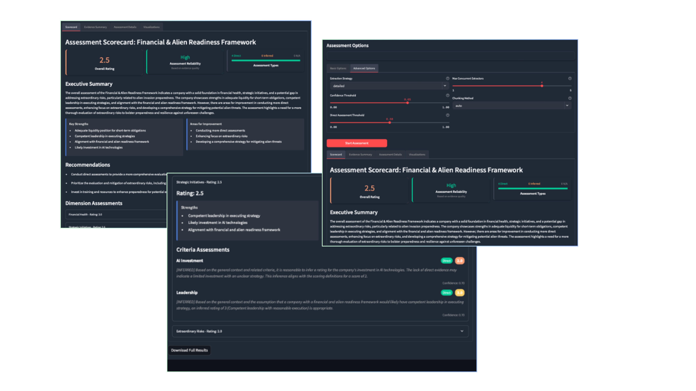
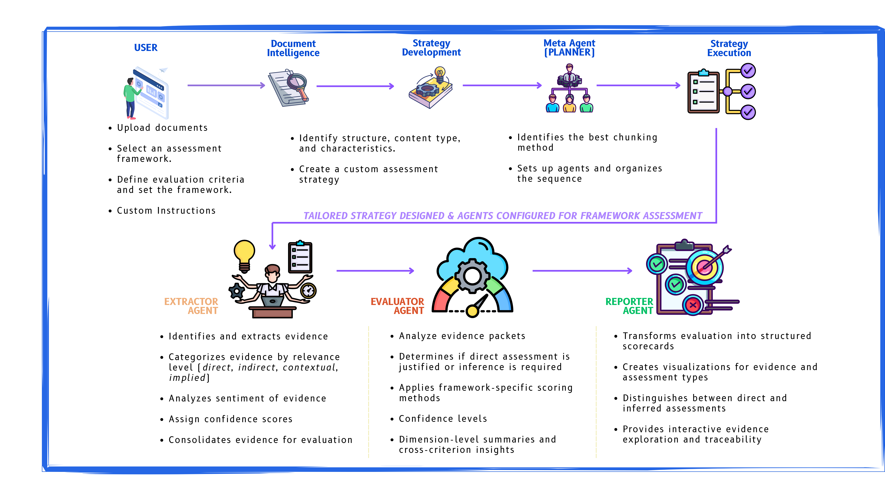

# 🧠 Learning Lab AI: Framework Assessment Workbench

> "AI is a tool for decision-making. It's also a product of decisions."

## 🔍 What is this?

The Framework Assessment Workbench is my experimental lab for transforming unstructured documents into structured insights. It evaluates content against assessment frameworks using a streamlined multi-agent approach, going beyond simple keyword matching to provide comprehensive, evidence-based assessments.

<p align="center">
  
</p>

## 💡 Why I Built This

I believe the most valuable AI systems are ones that enhance human decision-making rather than trying to replace it. This workbench demonstrates several principles I'm passionate about:

1. **Evidence-Based Assessment** - Explicit traceability from conclusions back to source text
2. **Human-AI Collaboration** - Augmenting analytical capabilities while preserving human judgment
3. **Practical Experimentation** - Learning through building, not just theorizing

## 🏗️ Technical Architecture: Strategic Multi-Agent Orchestration

<p align="center">
  
</p>

### Key Components

#### 🤖 Meta Planner Agent
- Analyzes document structure and framework complexity
- Generates targeted evidence extraction instructions
- Identifies related criteria for combined evaluation
- Designs optimal chunking and processing strategies

#### 🔍 Streamlined Extractor Agent
- Two-pass evidence collection approach:
  - First pass: Extract evidence from each document chunk
  - Second pass: Consolidate into comprehensive evidence packets
- Clear focus on direct quotes and metrics
- Produces one consolidated evidence packet per criterion

#### ⚖️ Enhanced Evaluator Agent
- Processes consolidated evidence packets
- Distinguishes between direct and inferred assessments
- Can evaluate related criteria together for consistency
- Provides confidence scores and clear rationales

#### 📊 Reporter Agent
- Transforms evaluations into structured reports
- Creates visualizations and exportable formats
- Maintains traceability from assessments to evidence

## 🔬 Innovative Approaches

### Consolidated Evidence Packets

Instead of fragmenting evidence across multiple small items, the system creates comprehensive evidence packets with a clear structure:

```
===== EVIDENCE PACKET FOR: [Criterion Name] =====

DIRECT QUOTES:
- Exact statements from the document

KEY METRICS:
- Numerical data and measurements

RELEVANCE ANALYSIS:
- Explanation of how the evidence relates to the criterion

ASSESSMENT IMPLICATION:
- What the evidence suggests about rating
```

This approach preserves context and makes assessment more reliable.

### Combined Criterion Evaluation

The evaluator can process related criteria together, ensuring consistency in assessments:

1. Identify related criteria within dimensions
2. Evaluate criteria groups with a holistic view
3. Ensure calibrated ratings across similar criteria

### LLM-Optimized Prompting

Instead of complex code, the system uses simple but effective prompts to guide the LLM:

- Clear, non-technical instructions
- Consistent output formats
- Focused queries that leverage LLM strengths

## 🚀 Getting Started

```bash
# Clone the repository
git clone https://github.com/kris-nale314/learning-lab-ai.git
cd learning-lab-ai

# Install dependencies
pip install -r requirements.txt

# Set up your API key
export OPENAI_API_KEY=your_key_here

# Launch the app
streamlit run app.py
```

## 💼 Real-World Applications

### Organizational Assessment
- Evaluate documents against maturity models or compliance frameworks
- Identify gaps in organizational documentation
- Automate consistency checks across complex regulations

### Meeting Analysis
- Analyze earnings call transcripts against assessment criteria
- Verify that all required topics were addressed
- Identify missing discussion points for follow-up

### Content Evaluation
- Evaluate research papers against methodological standards
- Check educational content against curriculum requirements
- Validate marketing materials against brand guidelines

## 🧪 Why I Build Experimental AI Systems

Building hands-on systems like this provides insights that can't be gained from theory alone:

1. **Practical Limitations** - Discovering where current LLM capabilities truly shine or struggle
2. **Architecture Testing** - Understanding how different system designs perform in real-world scenarios
3. **Integration Learning** - Finding unexpected interactions between components
4. **User Experience** - Learning how humans interact with AI-generated assessments

> "The gap between theory and implementation is where the most valuable lessons hide."

## 📝 License

This project is licensed under the MIT License - see the [LICENSE](LICENSE) file for details.

---

*The Framework Assessment Workbench is an experimental tool designed to explore practical multi-agent orchestration and document intelligence techniques. It's a work in progress, continuously evolving as I experiment with different approaches.*